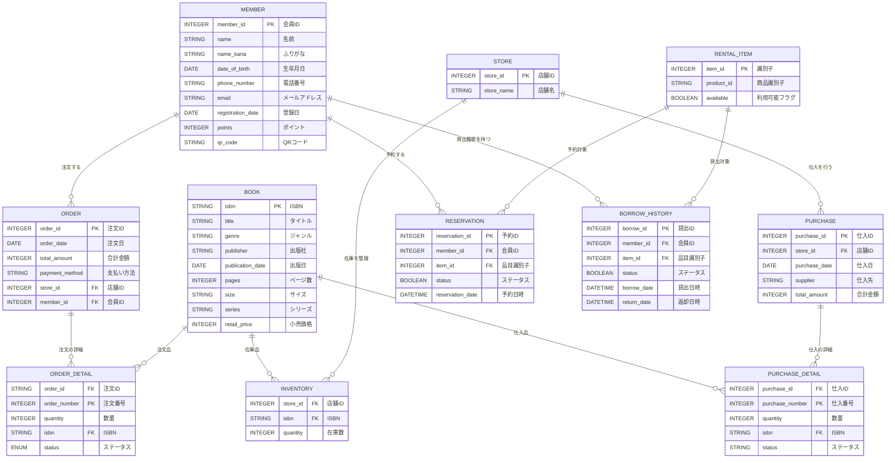

# 書店管理システム

## 概要
本システムは書店チェーンの在庫管理、発注管理、および注文管理を行うためのWebアプリケーションです。店舗スタッフが使用することを想定し、書籍の発注から入荷までの一連の業務をサポートします。

## 主な機能
- 書籍発注管理
- 発注進捗の確認
- 在庫引当依頼の管理
- 店舗在庫の管理
- 会員情報の管理

## 技術スタック
- バックエンド: Python (Flask)
- データベース: SQLAlchemy (ORM)
- フロントエンド: HTML, TailwindCSS
- アイコン: Feather Icons

## 必要要件
- Python 3.7以上
- Flask
- Flask-SQLAlchemy
- その他requirements.txtに記載の依存パッケージ

## セットアップ手順

1. リポジトリのクローン
```bash
git clone https://github.com/yourusername/bookstore_app.git
cd bookstore_app
```

2. 仮想環境の作成と有効化
```bash
python -m venv venv
source venv/bin/activate  # Unix/macOS
venv\Scripts\activate     # Windows
```

3. 依存パッケージのインストール
```bash
pip install -r requirements.txt
```

4. データベースの初期化
```bash
flask db upgrade
```

5. アプリケーションの起動
```bash
python run.py
```

## データベース構造


### 主要テーブル
- members: 会員情報
- books: 書籍マスタ
- orders: 注文情報
- order_details: 注文明細
- stores: 店舗情報
- inventories: 在庫情報
- purchases: 仕入れ情報
- purchase_details: 仕入れ明細

## 機能詳細

### 発注管理
- 書籍検索と発注数量の指定
- 倉庫/店舗ごとの配送日数確認
- 発注進捗のステータス管理（配送中/検品中）

### 在庫引当
- 注文に対する在庫引当処理
- 在庫不足時の発注連携
- 引当状況の一覧表示

### 画面説明
- `/`: ログイン画面
- `/home`: ホーム画面
- `/order-form`: 発注入力画面
- `/order-progress`: 発注進捗確認画面
- `/order-requests`: 引当依頼一覧画面

## 開発ガイドライン

### コーディング規約
- PEP 8に準拠したPythonコード
- アプリケーションの構造はBlueprintパターンを使用
- データベース操作はSQLAlchemyのORMを使用

### テストについて
- ユニットテストはPytestを使用
- テストカバレッジの維持

## ライセンス
MIT License

## 注意事項
- 本システムは開発中のため、機能は随時更新される可能性があります
- 本番環境での使用前に、セキュリティ設定の確認を推奨します
